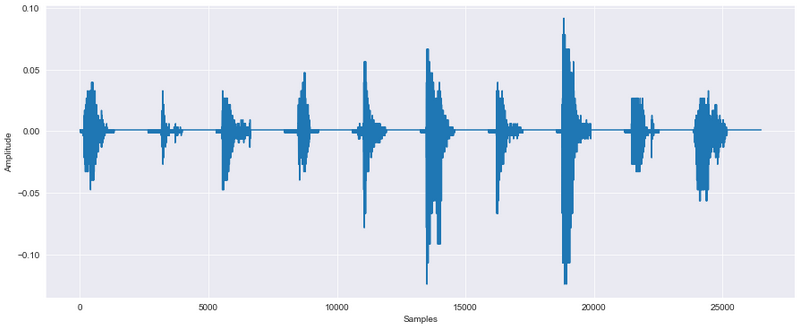
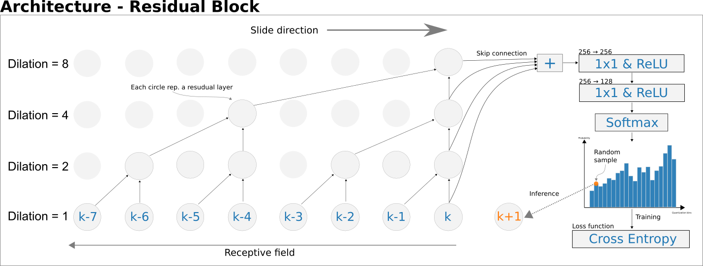
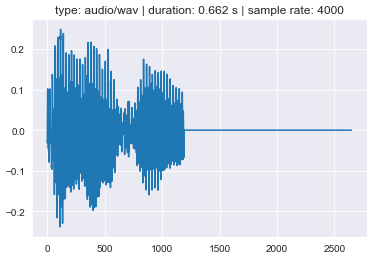
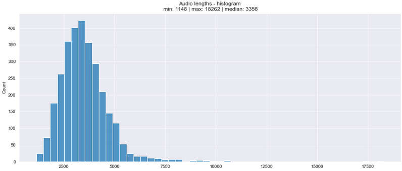
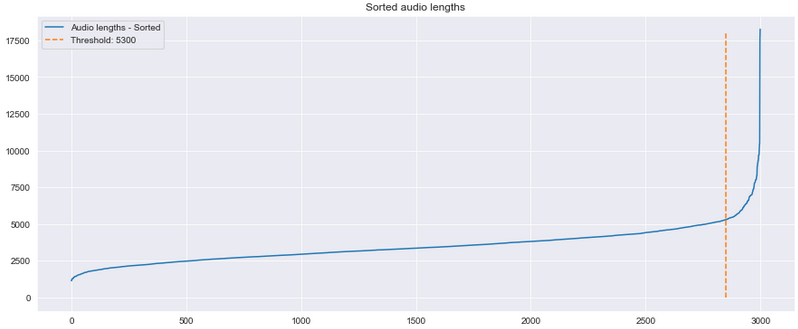
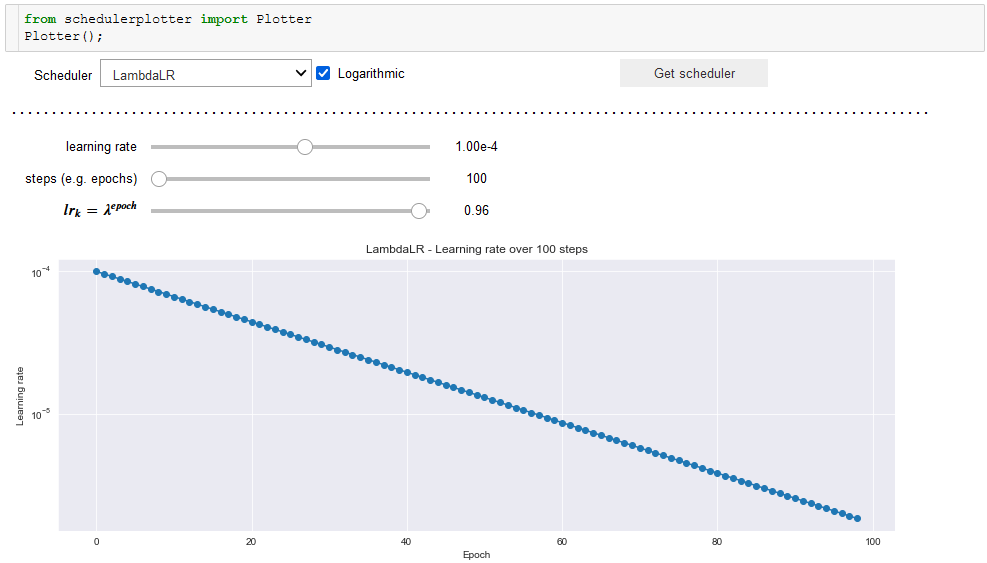
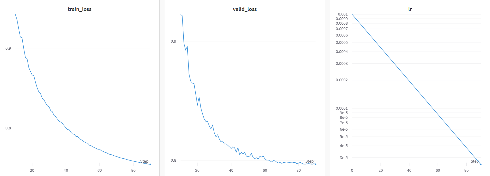

# Sound Synthesis Demo
<br>
INSERT combined.mp4
<br>
<p aling="center">
    
</p>

# WaveNet architecture - a breif introduction
Wavenet is an autoregressive model that use local and global embeddings to generate audio from transcripts. The local embeddings are used to convey local transcript information to the model i.e. what needs to be said and when. The global embeddings are transmitted to the entire model and can be used for e.g. speaker embeddings (generate sound in a specific voice). The model was originally praised for two things (1) producing audio that sounded very natural (2) for being parallelizable during training unilike RNNs.
<br>
<br>
I'm not gonna explain WaveNet in details, because it would take way to much time do. I have however made a simple figure which can be seen below. This don't tell the whole story, but should hopefully get the main point(s) across. 
<br>
<br>
<p align="center">
  
</p>

# Acknowledgement

* Zohar Jackson's [free spoken digit dataset dataset](https://github.com/Jakobovski/free-spoken-digit-dataset) was used for training and evaluation
* The model architecture was directly inspired by Google's original Wavenet paper [A Generative Model for Raw Audio](https://export.arxiv.org/abs/1609.03499)
* Text to phoneme embeddings was done with Kyubyong Park's [g2p_en](https://github.com/Kyubyong/g2p)
* r9y9's [WaveNet implementation](https://github.com/r9y9/wavenet_vocoder) was used for inspiration

# 1.) Imports and config
The config file contains all the hyperparameters (learning rate, epochs, etc.), control variables if debug mode, paths, etc.) and alike.

<details>
	<summary><b><u>PRESS THIS TO SEE THE CODE</u></b></summary>


```python
# pip install g2p-en
from g2p_en import G2p

# Mine
import helpers as H

# Model stuff
from sklearn.model_selection import train_test_split
import wandb
import torch
import torch.nn as nn
import torch.nn.functional as F
import torchaudio

# All around
from tqdm.notebook import tqdm
from IPython import display
import IPython
import os
import matplotlib.pyplot as plt
from IPython.display import Audio
from IPython.core.display import display
import seaborn as sns; sns.set_style("darkgrid")
import numpy as np
import pandas as pd
from glob import glob
import shutil
```


```python
class Config:
    # Control
    mode = "train"
    debug = False
    use_wandb = True
    device = torch.device("cuda:0" if torch.cuda.is_available() else "cpu")
    wandb_watch_activated = False
    epochs_trained = 0
    
    # Dataset downloaded from: 
    # https://github.com/Jakobovski/free-spoken-digit-dataset
    path_main = "./data/"
    assert os.path.exists(path_main), "path_main - Bad path"

    # General hypers
    batch_size = 20
    epochs = 100
    criterion = nn.CrossEntropyLoss()
    optimizer_hyper = dict(lr = 1e-3)
    optimizer = torch.optim.Adam   
    scheduler_hyper = dict(lr_lambda = lambda epoch: 0.96 ** epoch)
    scheduler = torch.optim.lr_scheduler.LambdaLR
    
    # Model specific hypers
    sample_rate = 4_000
    bins = 64
    channels = 256
    dilation_depth = 9
    blocks = 1
    
    # Seed everything
    seed = 12
    H.seed_torch(seed, deterministic=True)
    
    # Wandb
    to_log = dict(
        seed = seed,
        mode = mode,
        debug = debug,
        device = device,
        epochs=epochs,
        batch_size = batch_size,
        criterion = criterion,
        optimizer = (optimizer, optimizer_hyper),
        scheduler = (scheduler, scheduler_hyper),
        model_hypers = {"bins":bins, "channels":channels, 
                        "dilation_depth":dilation_depth, "blocks":blocks},
        dataset="https://github.com/Jakobovski/free-spoken-digit-dataset",
        architecture="WaveNet with g2p embeddings",
        notes="Audio synthesis with numbers ranging from 0-9. Only Local embeddings used."
    )

C = Config()
if C.use_wandb:
    wandb.login()
    wandb.init(project="WaveNet", config=C.to_log)
```

</details>

# 2.) Preprocess audio

1. Overview
2. Downsample
3. Maximum sound length and zero padding
4. Apply preprocessing - downsample and cutoff
5. Train and validation split
6. EmbeddingNet - Local and global embeddings
7. Dataset and Dataloaders

## Overview
The dataset contains 3,000 audio files of spoken digits ranging from 0-9. The file format is `.wav` and the freqency or sampling rate is 8,000 Hz. The audio files are recorded by 6 different speakers: `george`, `jackson`, `lucas`, `nicolas`, `theo`, `yweweler` whose responible for exactly 500 audio files each (50 for each digit). 

### Audio Sample


```python
sample_path = C.audio_paths[0]
waveform, sample_rate = torchaudio.load(sample_path)
H.jupyter_play_audio(sample_path)
```

<br>
INSERT audio_sample.mp4
<br>
<p align="center">
  
</p>

### Speakers (speaker distribution)


```python
def extract_name(path):
    string = os.path.basename(path)
    return_string = ""
    for c in string:
        if c.isalpha(): return_string += c
    return return_string

# Unique speakers
names = [ extract_name(path) for path in C.audio_paths ]
unique_speakers = set(names)
print("speakers: \n", unique_speakers, "\n")

# Distribution over number files recorded by each speaker
files_recorded = {speaker:0 for speaker in unique_speakers}
for name in names:
    files_recorded[name] += 1
print("Files recorded by count: \n", files_recorded)
```

    speakers: 
     {'georgewav', 'jacksonwav', 'ywewelerwav', 'theowav', 'nicolaswav', 'lucaswav'} 
    
    Files recorded by count: 
     {'georgewav': 500, 'jacksonwav': 500, 'ywewelerwav': 500, 'theowav': 500, 'nicolaswav': 500, 'lucaswav': 500}


## Down sample
A sampling rate of 8,000 Hz is relatively low (think the standard is 16,000 Hz and above). I'm going to downsmaple despite of this, because it makes the problem so much more tractable. After playing around with different sampling rates, I concluded that a reduction of 50% (4,000 Hz) seemed reasonable, comparison:


```python
down_sampler = torchaudio.transforms.Resample(sample_rate, 4000)

print("Freqency 8k (original)")
display(Audio(waveform, rate=8000))
print("Freqency 4k (down sampled)")
Audio(down_sampler(waveform), rate=4000)
```

<br>
Frequency 8k (original)
INSERT audio_sample.mp4
<br>
<br>
Frequency 4k (down sampled)
INSERT audio_sample_4k.mp4
<br>

## Maximum sound length and zero padding
WaveNet dosn't handle different sized inputs well. Technically speaking, one could get away with just making every batch the same size, but this is more trouble than it's worth in my opinion.
<br>
This means that we need to specify a maximum length for the audio files and use this to truncate/zero-pad every sound longer/shorter than this. 
<br>
An obvious maximum length would to the length of the longest audio file, but this is super wasteful. In the plot below, it's clear to see that the vast majority of the sounds are way shorter than that of the longest. There's no right solution here, but i think having 95\% of the files remain un-truncated would be reasonble. This would mean the cutoff would be the 95\% quantile


```python
audio_lengths = []
for path in C.audio_paths:
    audio_lengths.append(torchaudio.load(path)[0].squeeze(0).shape[0])

_, ax = plt.subplots(figsize=(15,6))
ax.set_title(f"Audio lengths - histogram\n min: {min(audio_lengths)} | max: {max(audio_lengths)} | median: {np.median(audio_lengths):.0f}")
sns.histplot(audio_lengths, bins=50, ax=ax);
```

<p align="center">
  
</p>


```python
threshold = int(np.ceil(np.quantile(audio_lengths, 0.95)))
sorted_lengths = sorted(audio_lengths)
threshold_index = np.searchsorted(sorted_lengths, threshold)

_, ax = plt.subplots(figsize=(15,6))
ax.plot(sorted_lengths, label="Audio lengths - Sorted")
ax.set_title(f"Sorted audio lengths")
ax.plot([threshold_index, threshold_index], [0, 18_000], '--', label=f"Threshold: {threshold}")
ax.legend()

threshold = threshold//2 # going to downsample before appling the threshold
```

<p align="center">
  
</p>

## Apply preprocessing - downsample and cutoff 
I'm going to apply both downsample and length cutoff (truncate/zero padd) before training to save time.


```python
!mkdir data

# Going to put everything in a dataframe for convenience.
df = pd.DataFrame( 
    {"path":[""]*3000, "speaker": [""]*3000, "number": [""]*3000, "pad_index": [0]*3000} 
)

for i, path in enumerate(tqdm(C.audio_paths)):
    waveform, sample_rate = torchaudio.load(path)
    new_waveform = down_sampler(waveform)
    
    if len(new_waveform) > threshold: # Truncate
        pad_index = threshold
        new_waveform = new_waveform[:, :threshold]
    else: # Zero pad
        pad_index = new_waveform.shape[1]
        num_zero_pad = threshold - new_waveform.shape[1]
        new_waveform = F.pad(new_waveform, pad=(0,num_zero_pad))
    
    assert new_waveform.shape[1] == threshold, "Should not have happend" # Just to be sure
    
    # Book keeping
    new_path = f"./data/{os.path.basename(path)}"
    number, speaker = os.path.basename(path).split("_")[:-1]
    df.iloc[i] = [new_path, speaker, str(number), pad_index]
    torchaudio.save(new_path, src=new_waveform, sample_rate=4000)
df
```


      0%|          | 0/3000 [00:00<?, ?it/s]


<div>
<style scoped>
    .dataframe tbody tr th:only-of-type {
        vertical-align: middle;
    }

    .dataframe tbody tr th {
        vertical-align: top;
    }
    
    .dataframe thead th {
        text-align: right;
    }
</style>
<table border="1" class="dataframe">
  <thead>
    <tr style="text-align: right;">
      <th></th>
      <th>path</th>
      <th>speaker</th>
      <th>number</th>
      <th>pad_index</th>
    </tr>
  </thead>
  <tbody>
    <tr>
      <th>0</th>
      <td>./data/0_george_0.wav</td>
      <td>george</td>
      <td>0</td>
      <td>1192</td>
    </tr>
    <tr>
      <th>1</th>
      <td>./data/0_george_1.wav</td>
      <td>george</td>
      <td>0</td>
      <td>2364</td>
    </tr>
    <tr>
      <th>2</th>
      <td>./data/0_george_10.wav</td>
      <td>george</td>
      <td>0</td>
      <td>2979</td>
    </tr>
    <tr>
      <th>3</th>
      <td>./data/0_george_11.wav</td>
      <td>george</td>
      <td>0</td>
      <td>1831</td>
    </tr>
    <tr>
      <th>4</th>
      <td>./data/0_george_12.wav</td>
      <td>george</td>
      <td>0</td>
      <td>2025</td>
    </tr>
    <tr>
      <th>...</th>
      <td>...</td>
      <td>...</td>
      <td>...</td>
      <td>...</td>
    </tr>
    <tr>
      <th>2995</th>
      <td>./data/9_yweweler_5.wav</td>
      <td>yweweler</td>
      <td>9</td>
      <td>1439</td>
    </tr>
    <tr>
      <th>2996</th>
      <td>./data/9_yweweler_6.wav</td>
      <td>yweweler</td>
      <td>9</td>
      <td>1389</td>
    </tr>
    <tr>
      <th>2997</th>
      <td>./data/9_yweweler_7.wav</td>
      <td>yweweler</td>
      <td>9</td>
      <td>1408</td>
    </tr>
    <tr>
      <th>2998</th>
      <td>./data/9_yweweler_8.wav</td>
      <td>yweweler</td>
      <td>9</td>
      <td>1582</td>
    </tr>
    <tr>
      <th>2999</th>
      <td>./data/9_yweweler_9.wav</td>
      <td>yweweler</td>
      <td>9</td>
      <td>1754</td>
    </tr>
  </tbody>
</table>
<p>3000 rows × 4 columns</p>
</div>


## Train and validation split
It's not immediately obvious how to do the split, but the follwing two approaches seem reasonable:
<br>
1. Use all audio files from a single speaker as validition set (would yeild 500 validation samples corrosponding to \~16.7% of the data) and the remaining files as training data
2. Do a random, but stratified, split over all speakers.
<br>

Both of these has obvious problems. Case 1. seems a bit unfair because the model has never heard that particular voice before. One could argue this would show generlazation capabilities, but I don't think this is necesarily true bevause we're dealing with sound synthesis. Case 2. may suffer from train-validition leakage, since it's reasonable to assume that digits spoken by the same speaker are very similiar. I do however think it's the best of the two, but it could be fun to test case 1. as well if time permits it.
<br>
Since I don't have that much data, the split is going to be 90\% for training and 10\% for validation. There's two choices for stratification "label": speaker and number. I decided (somewhat arbitrarily) to use the numbers.


```python
# train-validiation split
df_train, df_valid = train_test_split(df, test_size=0.1, stratify=df["number"])

# For debug
if C.debug:
    df_train = df_train.sample(C.batch_size)
    df_valid = df_valid.sample(C.batch_size//2)

df_train.reset_index(drop=True, inplace=True)
df_valid.reset_index(drop=True, inplace=True)
display(df_train)
display(df_valid)
```


<div>
<style scoped>
    .dataframe tbody tr th:only-of-type {
        vertical-align: middle;
    }

    .dataframe tbody tr th {
        vertical-align: top;
    }
    
    .dataframe thead th {
        text-align: right;
    }
</style>
<table border="1" class="dataframe">
  <thead>
    <tr style="text-align: right;">
      <th></th>
      <th>path</th>
      <th>speaker</th>
      <th>number</th>
      <th>pad_index</th>
    </tr>
  </thead>
  <tbody>
    <tr>
      <th>0</th>
      <td>./data/3_yweweler_10.wav</td>
      <td>yweweler</td>
      <td>3</td>
      <td>1334</td>
    </tr>
    <tr>
      <th>1</th>
      <td>./data/5_theo_31.wav</td>
      <td>theo</td>
      <td>5</td>
      <td>985</td>
    </tr>
    <tr>
      <th>2</th>
      <td>./data/6_yweweler_30.wav</td>
      <td>yweweler</td>
      <td>6</td>
      <td>1227</td>
    </tr>
    <tr>
      <th>3</th>
      <td>./data/8_yweweler_18.wav</td>
      <td>yweweler</td>
      <td>8</td>
      <td>982</td>
    </tr>
    <tr>
      <th>4</th>
      <td>./data/3_nicolas_45.wav</td>
      <td>nicolas</td>
      <td>3</td>
      <td>1027</td>
    </tr>
    <tr>
      <th>...</th>
      <td>...</td>
      <td>...</td>
      <td>...</td>
      <td>...</td>
    </tr>
    <tr>
      <th>2695</th>
      <td>./data/5_nicolas_47.wav</td>
      <td>nicolas</td>
      <td>5</td>
      <td>1678</td>
    </tr>
    <tr>
      <th>2696</th>
      <td>./data/5_yweweler_33.wav</td>
      <td>yweweler</td>
      <td>5</td>
      <td>1700</td>
    </tr>
    <tr>
      <th>2697</th>
      <td>./data/7_yweweler_12.wav</td>
      <td>yweweler</td>
      <td>7</td>
      <td>1354</td>
    </tr>
    <tr>
      <th>2698</th>
      <td>./data/2_yweweler_43.wav</td>
      <td>yweweler</td>
      <td>2</td>
      <td>1139</td>
    </tr>
    <tr>
      <th>2699</th>
      <td>./data/3_george_8.wav</td>
      <td>george</td>
      <td>3</td>
      <td>1537</td>
    </tr>
  </tbody>
</table>
<p>2700 rows × 4 columns</p>
</div>


<div>
<style scoped>
    .dataframe tbody tr th:only-of-type {
        vertical-align: middle;
    }

    .dataframe tbody tr th {
        vertical-align: top;
    }
    
    .dataframe thead th {
        text-align: right;
    }
</style>
<table border="1" class="dataframe">
  <thead>
    <tr style="text-align: right;">
      <th></th>
      <th>path</th>
      <th>speaker</th>
      <th>number</th>
      <th>pad_index</th>
    </tr>
  </thead>
  <tbody>
    <tr>
      <th>0</th>
      <td>./data/0_lucas_6.wav</td>
      <td>lucas</td>
      <td>0</td>
      <td>2144</td>
    </tr>
    <tr>
      <th>1</th>
      <td>./data/8_nicolas_30.wav</td>
      <td>nicolas</td>
      <td>8</td>
      <td>1513</td>
    </tr>
    <tr>
      <th>2</th>
      <td>./data/4_yweweler_7.wav</td>
      <td>yweweler</td>
      <td>4</td>
      <td>1099</td>
    </tr>
    <tr>
      <th>3</th>
      <td>./data/5_jackson_6.wav</td>
      <td>jackson</td>
      <td>5</td>
      <td>1594</td>
    </tr>
    <tr>
      <th>4</th>
      <td>./data/2_jackson_12.wav</td>
      <td>jackson</td>
      <td>2</td>
      <td>1950</td>
    </tr>
    <tr>
      <th>...</th>
      <td>...</td>
      <td>...</td>
      <td>...</td>
      <td>...</td>
    </tr>
    <tr>
      <th>295</th>
      <td>./data/7_jackson_41.wav</td>
      <td>jackson</td>
      <td>7</td>
      <td>1983</td>
    </tr>
    <tr>
      <th>296</th>
      <td>./data/6_jackson_34.wav</td>
      <td>jackson</td>
      <td>6</td>
      <td>2304</td>
    </tr>
    <tr>
      <th>297</th>
      <td>./data/3_theo_21.wav</td>
      <td>theo</td>
      <td>3</td>
      <td>2147</td>
    </tr>
    <tr>
      <th>298</th>
      <td>./data/9_yweweler_0.wav</td>
      <td>yweweler</td>
      <td>9</td>
      <td>1439</td>
    </tr>
    <tr>
      <th>299</th>
      <td>./data/9_yweweler_17.wav</td>
      <td>yweweler</td>
      <td>9</td>
      <td>1441</td>
    </tr>
  </tbody>
</table>
<p>300 rows × 4 columns</p>
</div>


## EmbeddingNet - Local and global embeddings
`EmbeddingNet` is responsible for making global and local embeddings for the `WaveNet` model.
<br>
The global embeddings are simply made from speaker IDs (integers) which gets one hot encoded and send throguh some 1x1 convolution to make the channels add up and provide some expresseive power. 
<br>
The local embeddings are made from phoneme predictions provided by [g2p](https://github.com/Kyubyong/g2p). These are one hot encoded, send through a "learned upscaling" net, interpolated and zero padded to match the shape of the waveforms.


```python
class EmbeddingNet(nn.Module):
    """ Provide global and local embeddings for WaveNet """

    def __init__(self, channels, max_length, num_of_speakers=None):
        """
        :param num_of_speakers:     Number of speakers used in the global conditioning
        :param channels:            Number of channels used in WaveNet
        :param device:              "cuda" or "cpu"
        """

        super().__init__()
        self.num_of_speakers = num_of_speakers
        self.channels = channels
        self.max_length = max_length

        # Local conditioning
        self.local_encoder = G2p()
        self.local_cond_tokens = [" ", ",", "!", "?", "'", ".", "<PAD>"] + self.local_encoder.phonemes[4:]
        self.local_cond_dict = {token: i for i, token in enumerate(self.local_cond_tokens)}
        self.num_of_tokens = len(self.local_cond_tokens)

        self.local_up_sample_net = nn.Sequential(
            nn.Conv1d(self.num_of_tokens, self.channels, 1, 1),  # Correct #channels and remove one hot sparsity
            nn.ReLU(),
            nn.ConvTranspose1d(self.channels, self.channels, 4, 8), nn.ReLU(),  # up-sample 1.
            nn.ConvTranspose1d(self.channels, self.channels, 4, 6), nn.ReLU(),  # up-sample 2.
            nn.ConvTranspose1d(self.channels, self.channels, 4, 4), nn.ReLU(),  # up-sample 3.
        )

        # Global conditioning
        if num_of_speakers is not None:
            assert self.channels // 4 <= self.num_of_tokens, "The gradual increase in channel size makes no sense when true"
            self.global_net = nn.Sequential(
                nn.Conv1d(self.num_of_speakers, self.channels // 4, 1, 1), nn.ReLU(),  # channel increase 1.
                nn.Conv1d(self.channels // 4, self.channels // 2, 1, 1), nn.ReLU(),  # channel increase 2.
                nn.Conv1d(self.channels // 2, self.channels, 1, 1), nn.ReLU(),  # channel increase 3.
            )
            
    def forward(self, transcripts, pad_indices, speaker=None):
        """
        :param transcripts: What is being said in the waveform (Batch_size, samples)
        :param pad_indices: The index at which the waveforms were zero padded from.
        :param speaker:     Unique speaker ID used in the waveform recordings
        :return:
            local_cond         : Up-sampled and vectorized phonemes tokens (batch_size, channels, # up-scaled samples)
            global_cond        : Vectorized speaker id (batch_size, channels, 1)
        """

        if (speaker is not None) and (self.num_of_speakers is None):
            raise ValueError(
                "`speaker` not allowed when initialization occured without specifying `num_of_speakers`"
            )

        # Global and local conditioning
        local_cond = self.get_local_cond(transcripts, pad_indices)
        global_cond = self.get_global_cond(speaker) if (speaker is not None) else None

        return local_cond, global_cond


    def get_global_cond(self, speaker):
        one_hotted = F.one_hot(speaker, num_classes=self.num_of_speakers)
        correct_format = one_hotted.to(self.device).unsqueeze(0).permute(1, 2, 0).float()
        return self.global_net(correct_format)


    def get_local_cond(self, transcripts, pad_indices):
        # 1.) Phonemes tokens for each transcript
        # 2.) Up sampling
        # 3.) Interpolation according to individual zero padding indices
        # 4.) Extra zero padding to match `self.max_length`
        for_tensor = []
        for i, transcript in enumerate(transcripts):
            token_strings = self.local_encoder(transcript)
            token_ints = [self.local_cond_dict[s] for s in token_strings]
            tensor = torch.tensor([[75, 42, 60, 53]], dtype=torch.long, device="cuda")
            one_hotted = F.one_hot(tensor, num_classes=self.num_of_tokens).transpose(1, 2).float()
            up_sampled = self.local_up_sample_net(one_hotted)
            pad_index = up_sampled.shape[-1]*2 if (pad_indices[i] == -1) else pad_indices[i] # necessary for generation
            interpolated = F.interpolate(up_sampled, size=pad_index)
            padded = F.pad(interpolated, pad=(0, self.max_length - interpolated.shape[-1]))
            for_tensor.append(padded)

        return torch.cat(for_tensor)
```

## Dataset and Dataloaders
The `DigitDataset` is a pretty standard custom dataset class designed to be used in Pytorch's `DataLoader` class


```python
class DigitDataset:
    def __init__(self, data):
        self.data = data
        self.mu_encoder = torchaudio.transforms.MuLawEncoding(quantization_channels=C.bins)

    def __len__(self):
        return len(self.data)

    def __getitem__(self, i):
        path, speaker, number, cutoff_index = self.data.iloc[i]
        waveform = torchaudio.load(path)[0]
        target_waveform = self.mu_encoder(waveform)
        pred_waveform = F.one_hot(target_waveform.long(), num_classes=C.bins).transpose(1, 2).float()
        
        return pred_waveform[0], target_waveform[0], speaker, number, cutoff_index

train_dataset = DigitDataset(df_train)
valid_dataset = DigitDataset(df_valid)

dl_train = torch.utils.data.DataLoader(train_dataset, batch_size=C.batch_size, shuffle=True)
dl_valid = torch.utils.data.DataLoader(valid_dataset, batch_size=C.batch_size, shuffle=False)

del train_dataset, valid_dataset # No use for these
```

# Training
1. Setup EmbeddingNet and WaveNet
2. Setup los, optimizer and learning rate scheduler
3. Training loop with Weights and Biases
4. Visualization

## Setup EmbeddingNet and WaveNet
The role of `EmbeddingNet` has already been explained and my implementation of WaveNet was introduced in first section.
<br>
The parameter count for both models is in the neighbourhood 6 milion parameters, which seems very reasonable ─ perhaps even to modest, that is the models may not have a sufficient number of parameters to fulfil the task at hand.


```python
class Wavenet(nn.Module):
    """
    Pytorch of implementation of the original wavenet paper:
    https://arxiv.org/pdf/1609.03499.pdf
    Figure 3 in the paper summarizes the main ideas behind the model quite nicely
    """

    def __init__(self, embedding_net, quantization_bins=64, channels=128, dilation_depth=9, blocks=1, device="cuda"):
        """
        :param quantization_bins:   Number of possible sound amplitudes (e.g. 256 would be a 8 bit repr.)
        :param channels:            Number of channels used in all convolutions
        :param dilation_depth:      Number of dilated causal convolutional layers within each stack.
        :param blocks:              Number of blocks of stacked dilated causal convolutional layers.
        """
        super().__init__()
        self.device = device
        
        # Hyperparameters
        self.C = channels
        self.bins = quantization_bins
        self.dilations = [2 ** i for i in range(dilation_depth)] * blocks
        self.receptive_field = sum(self.dilations)
        self.embedding_net = embedding_net

        # Init model architecture
        self.pre_process_conv = nn.Conv1d(in_channels=self.bins, out_channels=self.C, kernel_size=1)

        self.causal_layers = nn.ModuleList()
        for d in self.dilations:
            self.causal_layers.append(ResidalLayer(channels=self.C, dilation=d))

        self.post_process_conv1 = nn.Conv1d(self.C, self.C, kernel_size=1)
        self.post_process_conv2 = nn.Conv1d(self.C, self.bins, kernel_size=1)

        # Set everything to correct device
        self.to(device)

    def forward(self, waveform:torch.tensor, transcripts:list, pad_indices:list, speaker:int=None):
        """
        :param waveform:    Mu- and one-hot-encoded waveform. (batch_size, quantization_bins, samples).
        :param transcripts: What is being said in the waveform (Batch_size, samples)
        :param pad_indices: The index at which the waveforms were zero padded from. (batch_size)
        :param speaker:     Unique speaker ID used in the waveform recordings (batch_size)

        :return:
        Distribution over predictions for the next sample. (batch_size, quantization_bins, samples)
        """
        # TODO: Check input shape and type

        # Pre-processing
        local_cond, global_cond = self.embedding_net(transcripts, pad_indices, speaker=None)
        return self._forward(waveform, local_cond, global_cond)


    def _forward(self, waveform, local_cond, global_cond ):
        # Pre-processing
        x = self.pre_process_conv(waveform)

        # Dilated causal convolutions
        skips, skip = [], None

        for layer in self.causal_layers:
            x, skip = layer(x, local_cond, global_cond)
            skips.append(skip)

        # Post processes (-softmax)
        x = sum([s[:, :, -skip.size(2):] for s in skips]) # Sum all the skips values made
        x = F.relu(x)
        x = self.post_process_conv1(x)  # shape --> (batch_size, channels, samples)
        x = F.relu(x)
        x = self.post_process_conv2(x)  # shape --> (batch_size, quantization_bins, samples)
        return x


    @torch.no_grad()
    def generate(self, transcript:str, seed:list = None, speaker:int = None):
        """
        Warning: This is as slow as it gets and could definitely be improved.

        :param transcript:  Text used for global embeddings
        :param seed:        Seed to start of the generation (if None --> random seed)
        :param speaker:     Speaker ID
        :return:            List of generated samples
        """
        local_emb, global_emb = self.embedding_net([transcript], [-1], speaker)

        # Generate random seed if seed is None
        temp = seed
        if temp is None:
            temp = np.random.randint(self.bins//2 - 1, self.bins//2 + 1, self.receptive_field + 1)

        for n in tqdm(range(local_emb.shape[2] - self.receptive_field), leave=False):
            x = torch.tensor(temp[-(self.receptive_field + 1):]).to(self.device)
            x =  F.one_hot(x.unsqueeze(0).long(), num_classes=self.bins).transpose(1,2).float()

            predictions = self._forward(x, local_emb[:, :, n: n+self.receptive_field], global_emb)
            predictions = torch.softmax(predictions, dim=1)
            sampled_index = torch.multinomial(predictions[0, :, 0], 1).squeeze()
            temp.append(sampled_index.item())

        return temp


class ResidalLayer(nn.Module):
    """ Wavenet residual layer (with a few modifications)"""

    def __init__(self, channels:int, dilation:int, do_local_cond:bool=True, do_global_cond:bool=False):
        """
        :param in_channels:     1D Convolution: Number of input channels
        :param out_channels:    1D Convolution: Number of output channels
        :param dilation:        1D Convolution: dilation
        """

        super().__init__()
        self.dilation = dilation
        self.do_local_cond = do_local_cond
        self.do_global_cond = do_global_cond

        # Gated activation. conv_f (filter) and conv_g (gate).
        self.conv_f = nn.Conv1d(channels, channels, kernel_size=2, dilation=dilation)
        self.conv_g = nn.Conv1d(channels, channels, kernel_size=2, dilation=dilation)

        # Local conditioning
        if do_local_cond is not None:
            self.conv_filter_local = nn.Conv1d(channels, channels, kernel_size=1, dilation=dilation)
            self.conv_gate_local = nn.Conv1d(channels, channels, kernel_size=1, dilation=dilation)

        # Global conditioning
        if do_global_cond is not None:
            self.conv_filter_global = nn.Conv1d(channels, channels, kernel_size=1, dilation=dilation)
            self.conv_gate_global = nn.Conv1d(channels, channels, kernel_size=1, dilation=dilation)

        self.conv_1x1 = nn.Conv1d(channels, channels, kernel_size=1)


    def forward(self, waveform, local_cond, global_cond):
        # General filter and gate preprocess
        filter_in = self.conv_f(waveform)
        gate_in = self.conv_g(waveform)

        # Local conditioning preprocess
        if self.do_local_cond:
            local_cond = local_cond[:, :, -filter_in.shape[2]:]
            filter_in += self.conv_filter_local(local_cond)
            gate_in   += self.conv_gate_local(local_cond)

        # Global conditioning preprocess
        if self.do_global_cond:
            filter_in += self.conv_filter_global(global_cond)
            gate_in   += self.conv_gate_global(global_cond)

        # Gated activation
        filter_out = torch.tanh(filter_in)
        gate_out = torch.sigmoid(filter_out)
        filter_and_gate_combined = filter_out * gate_out

        # Residual for next residual layer
        skip = self.conv_1x1(filter_and_gate_combined)
        residual = waveform[:, :, self.dilation:] + skip

        return residual, skip


# Init WaveNet
embedding_net = EmbeddingNet(C.channels, threshold)
wavenet = Wavenet(embedding_net, C.bins, C.channels, C.dilation_depth, C.blocks, C.device)
print("wavenet + embedding_net parameter count: ", H.get_parameter_count(wavenet))

# Sanity check (single forward pass)
waveform, target, speaker, transcript, cutoff_index = next(iter(dl_train))
print(wavenet( waveform.to(C.device), transcript, cutoff_index, speaker).shape)
del waveform, target, speaker, transcript, cutoff_index
```

    wavenet + embedding_net parameter count:  6.231E+06
    torch.Size([20, 64, 2139])


## Setup loss, optimizer and learning rate scheduler
Cross entropy is a no brainer for loss because WaveNet outputs a probability distribution.
<br> 
Adam was used as optimizer with a start learning rate of 1e-3 and Pytorch's `LambdaLR` was used as LR-scheduler.
<br>
The LR-scheduler was found with a small Jupyter notebook GUI I have written see [here](https://github.com/Jako-K/schedulerplotter). Picture below:
<br>
<p align="center">
    
</p>


```python
optimizer = C.optimizer(wavenet.parameters(), **C.optimizer_hyper)
scheduler = C.scheduler(optimizer, **C.scheduler_hyper)
```

## Training loop
I've used a pretty standard Pytorch training loop with validation, logging, and best model saving. Something like: 
```python
model, optimizer, schedular = init_model()
train_dl, valid_dl = init_data()

for epoch in epochs:
    do_training_stuff(model, optimizer, train_dl)
    do_validation_stuff(model, valid_dl)
    do_update_and_logging_stuff(schedular, model)
```


```python
###################################################################################################
#                                             Setup                                               #
###################################################################################################

if C.use_wandb and not C.wandb_watch_activated: 
    C.wandb_watch_activated = True
    wandb.watch(wavenet, C.criterion, log="all", log_freq=10)
    
stats = pd.DataFrame(np.zeros((C.epochs,3)), columns=["train_loss", "valid_loss", "learning_rate"])
best_model_name = "0_EPOCH.pth"
print(H.get_gpu_memory_info())

###################################################################################################
#                                          Training                                               #
###################################################################################################

for epoch in tqdm(range(C.epochs)):
    train_losses, valid_losses = np.zeros(len(dl_train)), np.zeros(len(dl_valid))

    wavenet.train()
    for i, batch in enumerate(tqdm(dl_train, leave=False)):
        waveform, target, speaker, transcript, cutoff_index = batch
        waveform, target = waveform.to(C.device), target.to(C.device)
        
        # Forward pass
        preds = wavenet(waveform, transcript, cutoff_index, speaker)
        
        # Calculates loss. The whole indexation show is just to align predictions with the targets.
        loss = C.criterion(preds[:, :, :-1], target[:, -preds.size(2)+1:])
        
        # Backward pass
        loss.backward()
        
        # Batch update and logging
        optimizer.step()
        optimizer.zero_grad()
        train_losses[i] = loss.detach().cpu().item()
        
    wavenet.eval()
    with torch.no_grad():
        for i, batch in enumerate(tqdm(dl_valid, leave=False)):
            waveform, target, speaker, transcript, cutoff_index = batch
            waveform, target = waveform.to(C.device), target.to(C.device)
            
            # Forward pass and loss
            preds = wavenet(waveform, transcript, cutoff_index, speaker)
            loss = C.criterion(preds[:, :, :-1], target[:, -preds.size(2)+1:])
            
            # Batch update and logging
            valid_losses[i] = loss.detach().cpu().item()
    
    # Epoch update and logging
    train_mean, valid_mean = train_losses.mean(), valid_losses.mean()
    lr = optimizer.param_groups[0]["lr"]
    stats.iloc[epoch] = [train_mean, valid_mean, lr]
    scheduler.step()
    C.epochs_trained += 1
    
    if C.use_wandb:
        wandb.log({"train_loss": train_mean, "valid_loss": valid_mean, "lr":lr})
    
    # Save model if it's better than the previous best
    if (epoch > 0) and (stats["valid_loss"][epoch] < stats["valid_loss"][epoch-1]):
        extra_info = {"valid_loss":valid_mean, "epochs_trained":C.epochs_trained}
        best_model_name = T.get_model_save_name(extra_info, "model.pth", include_time=True)
        torch.save(wavenet.state_dict(), best_model_name)

###################################################################################################
#                                          Finish up                                              #
###################################################################################################
        
# Plot
fig, (ax1, ax2) = plt.subplots(2,1, figsize=(20,10))
stats.drop(columns=["learning_rate"]).plot(ax=ax1, style=".-")
ax2.ticklabel_format(style="scientific", axis='y', scilimits=(0,0))
stats["learning_rate"].plot(ax=ax2, style=".-")

# Save model
if C.use_wandb:
    shutil.copy(best_model_name, os.path.join(wandb.run.dir, best_model_name))
    wandb.save(best_model_name, policy="now")
```

<p aling="center">
    
</p>

# Model evalutation - sound synthesis

## Load the best model
Use the model with the lowest validation loss for sound synthesis


```python
best_model_name = "time 01.15.58 16-08-2021  .  valid_loss 0.79693  .  epochs_trained 91  .  model.pth"
checkpoint = torch.load(best_model_name)
wavenet.load_state_dict(checkpoint)
wavenet.eval();
```

## Generate helpers


```python
# Helpers for sound synthesis
mu_encoder = torchaudio.transforms.MuLawEncoding(quantization_channels=C.bins)
mu_decoder = torchaudio.transforms.MuLawDecoding(quantization_channels=C.bins)
down_sampler = torchaudio.transforms.Resample(8000, 4000)

# Combine everything related to sound synthesis in one function
def generate_all(transcript, model, save_name, seed): 
    if seed is not None:
        seed = down_sampler(seed)
        seed = mu_encoder(seed[:, :wavenet.receptive_field+1])[0].tolist()
        
    # Generate and decode sound
    gen = wavenet.generate(transcript, seed)
    mu_decoded_gen = mu_decoder(torch.tensor(gen))
    gen_export = mu_decoded_gen.view(1,-1).float()
    
    # Save sound   
    torchaudio.save(f'{save_name}_generated.wav', gen_export, sample_rate=C.sample_rate)
```

## Actual audio generation
Generate digit sounds (0-9) from seeds found in `./digits_for_generation`


```python
# Sound generation and seeds
for i in range(10):
    seed = torchaudio.load(f"./data/{i}_yweweler_0.wav")[0]
    generate_all(f"{i}", wavenet, save_name=f"final_{i}", seed=seed)

# Combine all 10 sounds to a single .wav
generated_sounds_combined = torch.cat( 
    [torchaudio.load(f"final_{i}_generated.wav")[0][0] for i in range(10)] 
).unsqueeze(0)
torchaudio.save(f'combined.wav', generated_sounds_combined, sample_rate=4000)

# Make the combined sound playable and plot it
plt.figure(figsize=(15,6))
plt.xlabel("Samples")
plt.ylabel("Amplitude")
display(Audio('combined.wav', rate=4000))
plt.plot(generated_sounds_combined[0])
plt.show()
```

<br>
INSERT combined.mp4
<br>
<p aling="center">
    
</p>
